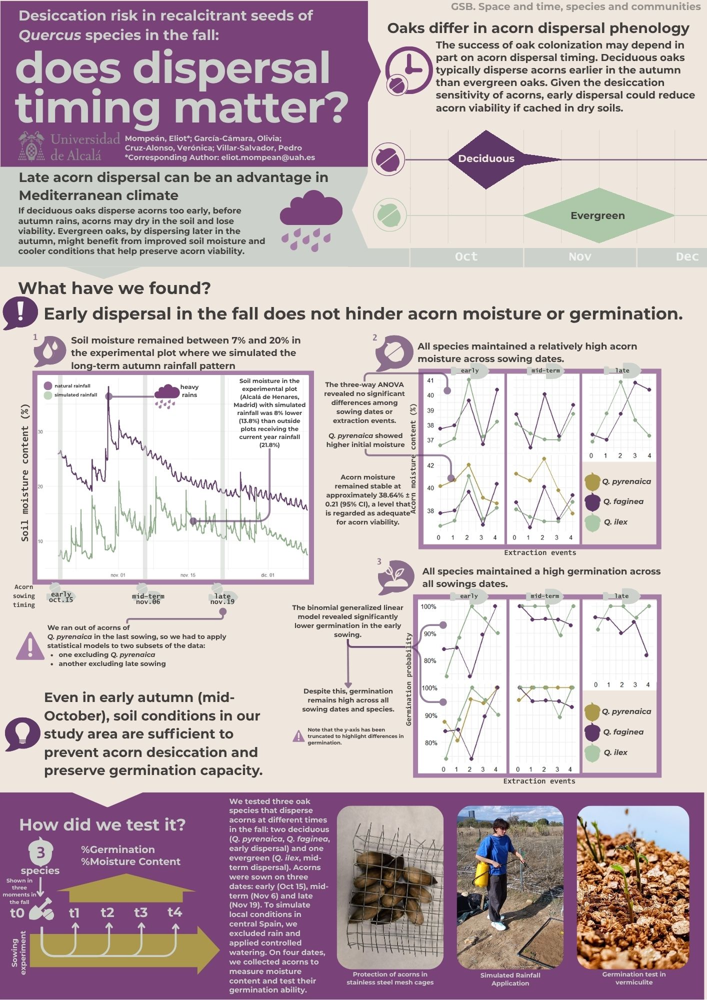

### Desiccation risk in recalcitrant seeds of Quercus species in the fall: does dispersal timing matter?

[👆 Save it!](AEET-SIBECOL-POSTER_ELIOT_V1.2.jpg){.btn .btn-secondary download="AEET-SIBECOL-POSTER_ELIOT_V1.2.jpg"}

### Abstract

Seed dispersal timing may influence plant colonization success. Compared to evergreen oaks, deciduous oaks tend to disperse acorns earlier in the autumn. Due to acorns’ sensitivity to desiccation, dispersal timing can potentially affect seed viability if dispersers cache acorns into dry soils. We predict that early dispersal in deciduous oaks increases the risk of acorn desiccation and viability loss in regions with late, warm autumns. Conversely, the latter dispersal of evergreen oaks could reduce acorn desiccation risks by benefiting from cooler conditions and increased soil moisture due to mid-late autumn rains. This study assess whether acorn dispersal timing affects its viability. A factorial sowing experiment was conducted with two deciduous oak species (*Q. faginea* and *Quercus pyrenaica*), and the evergreen *Q. ilex*. Acorns were sown at three times in the fall, mimicking each species´ peak dispersal timing. Regular watering simulated the average rainfall regime in Alcalá de Henares, central Spain. Over five sampling dates, acorns were collected to measure their moisture content and germination capacity. Contrary to predictions, acorns sown earliest showed no significant reduction in content or germination capacity. These results suggest that soil moisture during the dispersal periods of the earliest species is already sufficient to prevent desiccation impairing germination. Therefore, acorn dispersal timing seems to not hold significant ecological importance under the average rainfall conditions in the studied site.

Keywords: Acorn dispersal, Desiccation risk, Seed viability, Soil moisture.

Symposium topic: Space and time, species and communities
