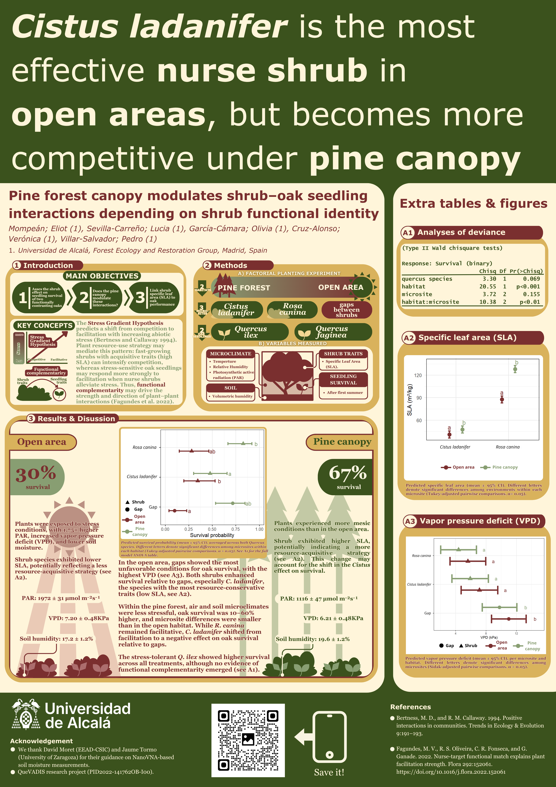

### Pine forest canopy modulates shrub–oak seedling interactions depending on shrub functional identity

[👆 Save it!](poster_v4.png){.btn .btn-secondary download="poster_v4.png"}

### Abstract

Some shrub species are known to facilitate oak recruitment in Mediterranean climates; however, much less is known whether different shrub species facilitate ecologically distinct oaks, and whether these interactions shift beneath forest canopies. We examined the effect of two shrub species on seedling survival of two ecologically distinct oaks (*Quercus faginea* and *Quercus ilex*), the underlying mechanisms of these interactions, and how they change under a forest canopy. We planted seedlings of both oaks across three microsites (*Rosa canina*, *Cistus ladanifer*, and gaps) in an open area and in the understory of a *Pinus pinaster* forest, and quantified shrub functional differences using specific leaf area (SLA). Postsummer survival was higher in the pine forest understory than in the open area, consistent with milder microclimatic conditions in the forest. *Q. ilex* exhibited higher survival than *Q. faginea*, regardless of microsite or environment (open and pine forest). In the open area, survival was higher beneath both shrubs than in gaps, particularly beneath *C. ladanifer*. In contrast, in the pine forest, the lowest survival was observed beneath *C. ladanifer*, whereas survival beneath *R. canina* was higher. Shrub facilitation was associated with the mitigation of extreme summer conditions, as microclimatic temperatures under *R. canina* canopies were lower than those under *C. ladanifer*. Shrub SLA was unrelated to facilitative or competitive capacity. This study supports the use of nurse shrubs to enhance the establishment of new oak seedlings in open spaces, with implications for their integration into forest restoration planning and implementation.

**Symposium topic: Plant community interactions: Relationships with symbiotic and mutualistic organisms**

Poster Session II (even numbered)

[👆 #BetterPoster](https://astrobites.org/2020/02/28/fixing-academic-posters-the-betterposter-approach/)
