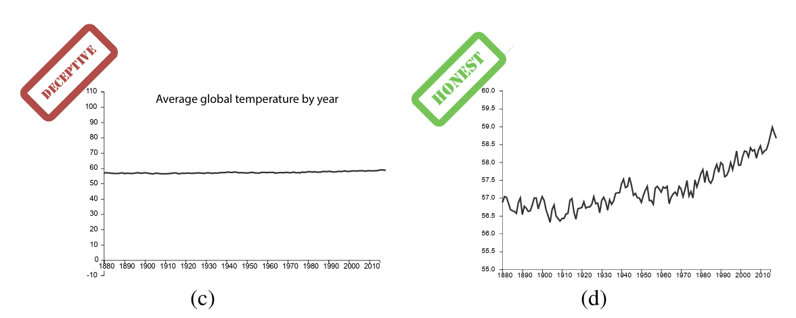

## Introduction

I often come across people on my social media feeds talking about how to make a "good" chart. Science communication is a fascinating field, and knowing how to build a solid chart is a crucial aspect of that communication. Communicating science in a 30-second vertical video is no easy task, so I understand why simplifications happen. However, there’s one that particularly triggers me: *whether or not to show zero on the y-axis (the vertical axis).*

In some videos, I find this oversimplified idea: *"not showing zero is a technique of scientific manipulation and bad practice."* For example, this [post from Chartosaur](https://vm.tiktok.com/ZNRKbve43/), a creator who makes excellent content about chart interpretation, drops this message:

> "If zero's not the start, the truth falls apart"

But this isn't a rule; it's a *heuristic*.

---

## On the utility of heuristics

If you dig deeper into this topic, you’ll find a whole series of "rules" on [how to make good charts](https://handsondataviz.org/chart-design.html), such as:

* Always start at zero.
* Don't use secondary axes.
* Don't use pie charts.
* Don't use 3D charts.

These and other statements are taken as absolute rules, but in reality, they are heuristics. In psychology, a heuristic is a mental shortcut to simplify a problem. For example, if I have to decide where to eat, I’ll probably choose the restaurant with the best reviews on Google Maps. But is that the most rigorous way to make a decision about where to eat? I could survey people leaving the establishment, study their menu and prices, and compare them with those of similar or nearby places. But while you’re busy drafting the survey, your stomach will give you a dose of reality and force you to make a quick decision. **That** is where heuristics are useful.

Heuristics in chart making serve the same function. They are general rules of thumb to guide you at the beginning. There are infinite chart types to choose from, and it’s easy to get lost; heuristics can help you make operational decisions. In the exploratory phase of an analysis, certain general rules can be helpful, but eventually, **the message comes first.**

---

## When heuristics fail

In the final stages of an analysis, when results begin to follow a pattern and conclusions emerge, conveying the message clearly and efficiently is the only thing that should matter. So, listen to me carefully: throw all the heuristics in the trash; they won't help you there.

> There is therefore not a clear binary distinction between 'deceptive' versus 'truthful' y-axis presentations: designers must take into account the range and magnitude of effect sizes they wish to communicate at a per-data and per-task level.

@Correll2019

Perhaps an example will make this clearer. Imagine the message you want to convey is that the latest government has worsened your country's economy. You examine a few economic indices, and—*voilà*—over the last 6 months, GDP has dropped by a few tenths of a percentage point. You build your line chart and start spreading the word.

```{r}
library(tidyverse)

set.seed(123)

data <- tibble(
  date = seq.Date(
    from = as.Date("2016-01-01"),
    by = "month",
    length.out = 120
  )
)

# sustained growth
data$GDP <- seq(100, 140, length.out = 120)

# some noise
data$GDP <- data$GDP + rnorm(120, 0, 0.25)

# drop in the last 6 months
data$GDP[115:120] <- data$GDP[114] + c(-0.2,-0.4,-0.6,-0.9,-1.2,-1.5)

data |>
  slice(115:120) |>
  ggplot(aes(date, GDP)) +
  geom_line(linewidth = 1.2) +
  geom_point(size = 2) +
  labs(
    title = "GDP has fallen during the last government's term",
    x = NULL,
    y = "GDP"
  ) +
  theme_minimal()

```

However, some people might point something out: if instead of selecting the timeframe that interests you, you take a wider range, the country's GDP has grown much more than it has fallen in the last six months.

```{r}
data |>
  ggplot(aes(date, GDP)) +
  geom_line(linewidth = 1.2) +
  geom_point(data = data |> slice(115:120),
             colour = "red",
             size = 2) +
  annotate(
    "rect",
    xmin = data$date[115],
    xmax = data$date[120],
    ymin = -Inf,
    ymax = Inf,
    alpha = .12,
    fill = "red"
  ) +
  labs(
    title = "The same drop seen with more context",
    x = NULL,
    y = "GDP"
  ) +
  theme_minimal()

```

Then the purists jump in: "Charts lie! You have to follow the conventions!" But was the chart to blame? Precisely—the chart did its job perfectly: it allowed us to convey the message that the latest government worsened the economy. Don't blame the chart; blame the message. The problem isn't how you scale the axes to emphasize a message; the problem is that, given the available data, the conclusion that the government worsened the economy isn't accurate.

Perhaps an example where excluding zero is appropriate will reinforce the idea. @Correll2019 give a very apt example. If, after performing our climate change analysis, we reach the conclusion that the temperature is increasing, would you choose a chart where you show zero (left, 0 degrees Fahrenheit) or would you truncate the axis to emphasize the differences (right)? And what if you also know that those differences, while numerically small, result in extremely important effects globally? You decide.



Again, charts are well-designed if they adequately convey a message. Questions about the certainty or rigor of the message are often much more complicated.